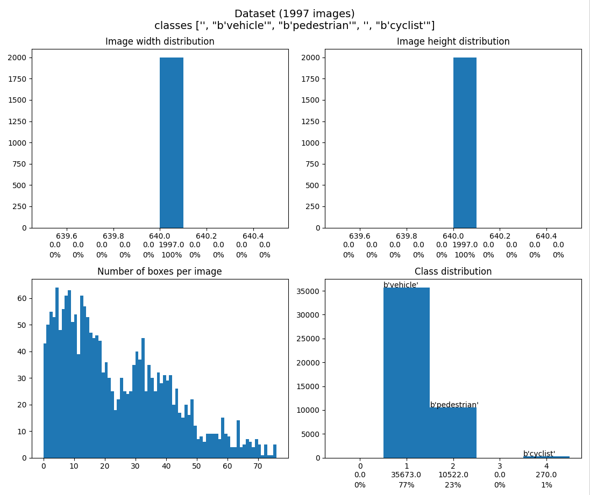
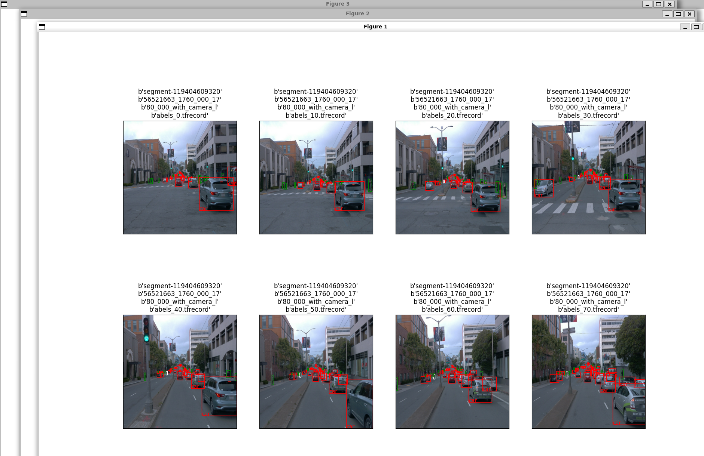
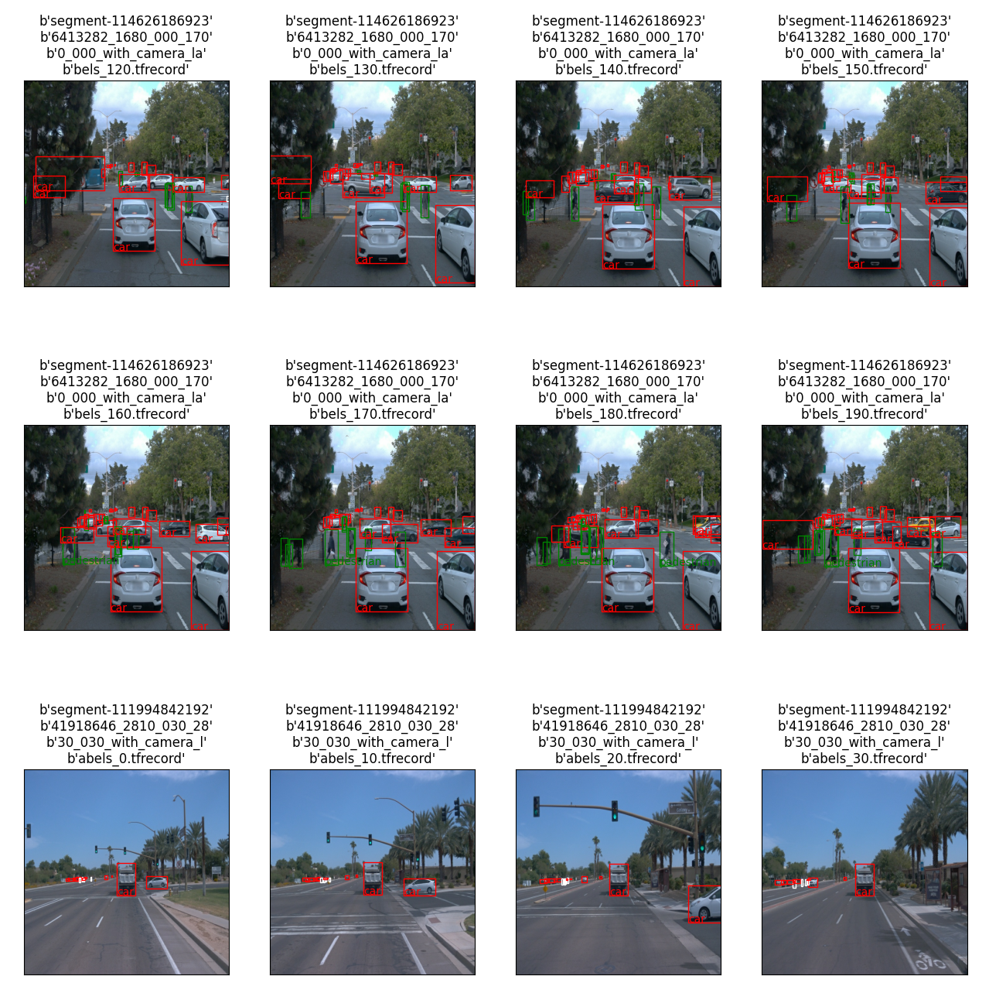
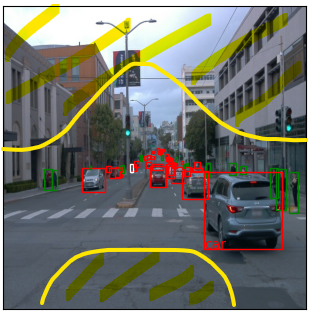
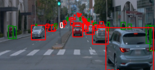

# Project 1 - Object Detection
# Udacity Nanodegree - Self Driving Car Engineer 
# Writeup

## Project overview
Object detection is one of the main crucial tasks during video perception in self driving cars or driver assistance systems.
In this project, each necessary step from set up and data analysis due to cross validation, training, evaluation and augmentation shall be practiced and implemented, due to the lessons learned in the first chapter and with example images from the Waymo Open dataset.

## Set up
After heavy difficulties to set up a local system, I have finally managed to run the repo inside of a container on wsl2 on windows with 
* GPU usage
* routing ports for tensorboard
* plotting images from matplotlib outside of the container

My setup including instructions and a description of difficulties along with necessary fixes are described in [alex_container_instructions.md](alex_container_instructions.md).

### Scripting
I have implemented some convenient scripts and helper classes (`./helpers`) to automize some of the steps defined in the project task and to reuse code for re-occuring tasks. These will be mentioned during each step, if relevant.

### Code versioning
During the implementation, I have used git / local gitlab instance for commmits and branches to save my increments. The progress and implementation steps should be understandable and visible via `gitk` or in any git gui.
### External sources
When using any code snippets from stack overflow or other sources during my research, I have tried to mark this or refer to the source in the code. In case I have forgotten or overseen some of them, I apologize for this.

I have put quite some effort into the docker setup and convenient scripts with the hope to be able to reuse those as templates for future machine learning projects.

## Questions to the tutor / corrector
Since this topic is new for me, I think I have implemented some functions way too complicated, and I guess for most of them are way better and integrated functions already present.
Could you please check my code, and give some hints, in case there already good library functions for code I have implemented? Especially regarding tfrecord handling, visualization and all the tooling stuff.
I have also marked some questions in the code with `# QUESTION TO TUTOR`. Could please refer to those?

## Dataset
### Dataset analysis
Dataset overview:
After using the provided download_process.py script, the data consists of 100 tfrecord files with a total of 1997 images and labels, taken from the Waymo Open dataset.

To be honest I had quite some difficulties with the tfrecord format and had to do quite some research and test scripts to get along with it. I played around with it in the file
`alex_print_image_project1.py`, which was then later moved to `helpers/project1.py` for project1 specific functionality.

After that, I tried to identify generic / common parts (which are not project1 specific) and added some helper classes to get a first impression of the data and to visualize it to my demands:
- `./helpers/exploratory_analysis.py`
- `./helpers/visualization.py`

Coming to the actual analysis and its implications:

My implemented helper class `./helpers/exploratory_analysis.py` contains the functions
- `get_classes_info`:

    Show data attributes of data stored in tfrecord file. This was necessary for me to understand what fields are available in an unknown tfrecord and to understand how to decode it. (Later I learned, that this is part of the proto files, but I could not find them in my repo.)

    Output:
    ```python
    tf.train.Example structure:
    - "image/encoded" (bytes_list): "\377\330\377\340\000\020JFIF\000\001\001\001\001,\001,\000\000\377\333\000C\000\002\001\001\001\001\001\002\001\001\001\002\002\002\002\002\004\003\0
    - "image/filename" (bytes_list): "segment-11940460932056521663_1760_000_1780_000_with_camera_labels_0.tfrecord"
    - "image/format" (bytes_list): "jpg"
    - "image/height" (int64_list): 640
    - "image/object/bbox/xmax" (float_list): 0.4230337142944336
    - "image/object/bbox/xmin" (float_list): 0.40658605098724365
    - "image/object/bbox/ymax" (float_list): 0.5190880298614502
    - "image/object/bbox/ymin" (float_list): 0.5013245344161987
    - "image/object/class/label" (int64_list): 1
    - "image/object/class/text" (bytes_list): "vehicle"
    - "image/source_id" (bytes_list): "segment-11940460932056521663_1760_000_1780_000_with_camera_labels_0.tfrecord"
    - "image/width" (int64_list): 640
    ```
- `show_dataset_basics`

    This prints the basic dataset information (number of images, the existing classes and their distribution) to the console. It will also show some basic histograms on width, height and class distribution:

    Output:
    ```python
    Dataset info:
        1997 elements from 1997 files
        Classes:
        0  : 0
        1  b'vehicle': 35673
        2  b'pedestrian': 10522
        3  : 0
        4  b'cyclist': 270
    ```
    

Both functions are called within the project task `Exploratory Data Analysis.ipynb`.

#### Implications:
- Available information per image:
    - actual image
    - format
    - width / height
    - original filename
    - boxes with class / label

    This is the minimum information we need. Images for training and boxes/labels for evaluation.
- There are 1997 images. This is not a big number for data driven methods.
    - -> TODO implications on data split?
    - -> TODO implications on cross-validation?    
    - -> TODO further implications
- All images have the same resolution (width x height). This means we don't need any additional layers in our model to adapt to differen image sizes
- The histogram "Number of boxes per image" in above diagram shows that there are quite a lot of images with > 30 boxes / objects, even some with > 70 boxes. This means that we will probably have very crowded images with a lot of occlusions, and maybe also a lot of tiny objects.
    - -> TODO implication? Algorithms from chapter?
- There are a lot of vehicle objects, only a few pedestrians and almost no cyclists (f). So it is doubtable that the model will perform well on unknown images for pedestrian or cyclist detection, if there are only 4 images to learn what a cyclist is, even worse if those 4 images would all be in the eval or test set.
    - --> TODO implication: use cross validation?

Having analyzed the basics and gain some information about data distribution and quality, we need to have a closer look into the data itself:
- What is the quality of our data?
- Do we need a cleanup of the data?
- Are there outliers?

For this, I have implemented the helper class `helpers/visualization.py` based on one of the practices we have made during the first chapter.
This can visualize big arbitrary sets of images from the dataset, shows the images in matrix plots and adds the boxes with labels. It is useful to have a closer short look on a bigger set of images and identify abnormalities.




Implications from the visualization:
- There are areas in most of the images where almost no objects can be found (upper left / right corner, bottom of image, see yellow area).

    

    If this has any impact on our model we will see during training. During augmentation we could somehow move the images a little to check the performance of objects in the yellow areas.
- Assumption from above regarding occlusion and tiny objects has proven true, and also above mentioned implications. I don't expect the model to detect the boxes which are only a few pixels in size.

    


#### Summary of Data analysis

A short summary of above implications are:
- --> TODO summary of implications


### Cross validation
This section should detail the cross validation strategy and justify your approach.

## Training
### Reference experiment
This section should detail the results of the reference experiment. It should includes training metrics and a detailed explanation of the algorithm's performances.

#### Own adaptions:
I had to override the model parameter `eval_config.metrics_set` with `coco_detection_metrics`, where the original parameter value `coco_detection_metrics` has thrown the error `'numpy.float64' object cannot be interpreted as an integer`. This fix has been provided via [https://knowledge.udacity.com/questions/657618](https://knowledge.udacity.com/questions/657618).

### Improve on the reference
This section should highlight the different strategies you adopted to improve your model. It should contain relevant figures and details of your findings.