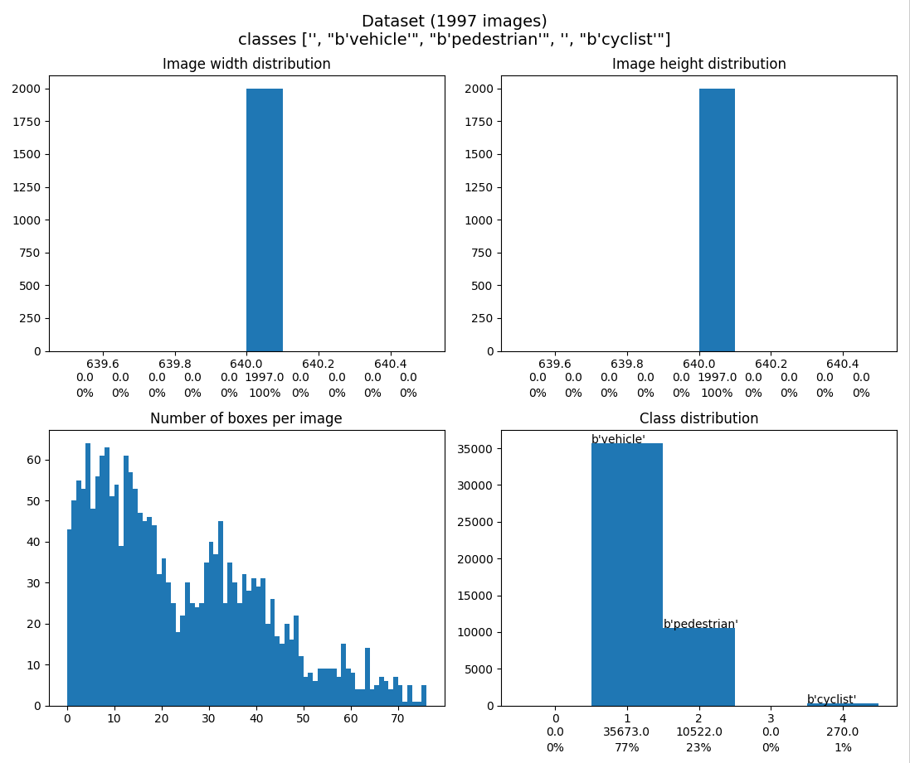

# Project 1 - Object Detection
# Udacity Nanodegree - Self Driving Car Engineer 
# Writeup

## Project overview
This section should contain a brief description of the project and what we are trying to achieve. Why is object detection such an important component of self driving car systems?

## Set up
After heavy difficulties to set up a local system, I have finally managed to run the repo inside of a container on wsl2 on windows. My setup and the difficulties along with necessary fixes are described in [alex_container_instructions.md](alex_container_instructions.md).

I have implemented some convenient scripts to automize some of the steps defined in the project task. These will be mentioned during each step, if relevant.
This section should contain a brief description of the steps to follow to run the code for this repository.

## Dataset
### Dataset analysis
This section should contain a quantitative and qualitative description of the dataset. It should include images, charts and other visualizations.

### Cross validation
This section should detail the cross validation strategy and justify your approach.

## Training
### Reference experiment
This section should detail the results of the reference experiment. It should includes training metrics and a detailed explanation of the algorithm's performances.

### Improve on the reference
This section should highlight the different strategies you adopted to improve your model. It should contain relevant figures and details of your findings.